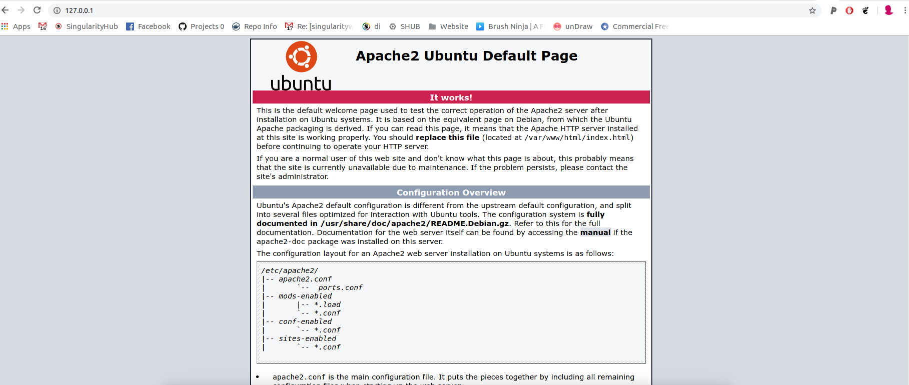

# Paraview with Singularity

This is an example of running paraview with Singularity (as an instance) to
allow for the apache server. It is based on [this Dockerfile](https://github.com/Kitware/paraviewweb/blob/master/tools/docker/demo/Dockerfile)
as a base. You can build the image:

```bash
$ sudo singularity build paraview-web.simg Singularity
```

Make a folder to bind to on the host:

```bash
$ mkdir -p /tmp/apache2
```

Start the container instance, here we are naming it "apache." Since we need writable
to /var/lock we must be sudo. :/

```bash
$ sudo singularity instance.start --bind /tmp/apache2:/var/run/apache2 paraview-web.simg apache
```

This should get apache2 running on localhost:



Note that you *must* stop local web servers, including any Docker applications
running on that port. I'm not privy to how paraview works, but given this setup
you should be able to figure it out from here. Here is how to shell into the
container:

```bash
$ sudo singularity shell instance://apache
```

And to stop the container, you also need sudo

```bash
$ sudo singularity stop instance://apache
```

I'm not sure if this is reasonable to run in user space because of needing write
to /var/lock. Using sudo with singularity seems to defeat the purpose. If you
figure out a good approach please send a pull request to this repository!

Note that if you are using Singularity 3.0 and up the instance group is now changed 
to "instance stop" and "instance start"
